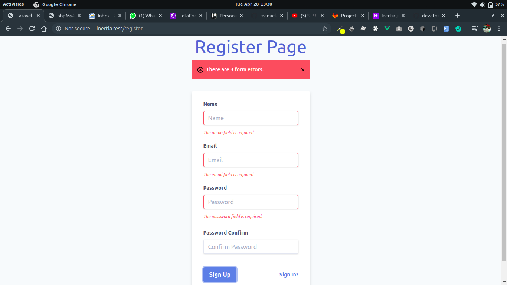
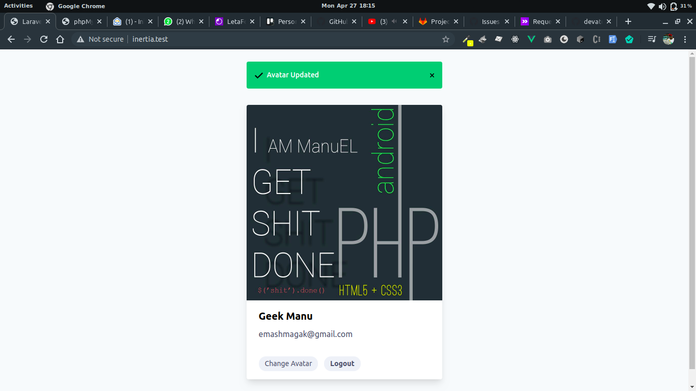

<p align="center"></p>


## About Laravel Inertia

 This is a sample Laravel project to illustrate Creating SPA with Inertia JS
 
 ## Set up 
 
 Fork and Clone the project  then;
 
 ```bash
composer install

cp .env.example .env

php artisan key:generate

php artisan migrate 

npm run dev

php artisan serve

```

## Features 
* Register
* Login
* Update Avatar
* CRUD
* Pagination

## Screenshot

<p align="center"></p>


<p align="center"></p>


## Resources

 [Inertia](https://inertiajs.com/)


## About Me
[Magak](https://magak.me)

## License

The Laravel framework is open-sourced software licensed under the [MIT license](https://opensource.org/licenses/MIT).

[](#)

[](#)


Happy coding, Star before Fork 😊💪💯
